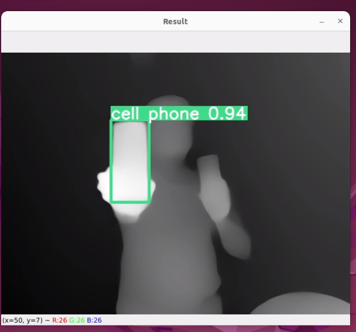
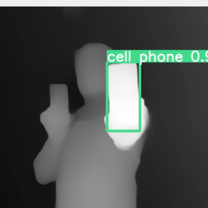

## Models
Download the any models to the root folder where run_webcam.py is available

[`yolov9-c.pt`](https://github.com/WongKinYiu/yolov9/releases/download/v0.1/yolov9-c.pt) [`yolov9-e.pt`](https://github.com/WongKinYiu/yolov9/releases/download/v0.1/yolov9-e.pt) [`gelan-c.pt`](https://github.com/WongKinYiu/yolov9/releases/download/v0.1/gelan-c.pt) [`gelan-e.pt`](https://github.com/WongKinYiu/yolov9/releases/download/v0.1/gelan-e.pt)

## Depth Anything

https://github.com/LiheYoung/Depth-Anything/blob/main/README.md

## YOLOv9

https://github.com/WongKinYiu/yolov9/blob/main/README.md

## Command

python3 run_webcam.py --encoder <vits | vitb | vitl>  --classes 67 --grayscale

--classes 0, or --classes 0 2 3' # to detect only  given classes https://github.com/manirajanvn/depth_anything_yolov9/blob/main/data/coco.yaml

## Results

    

    

